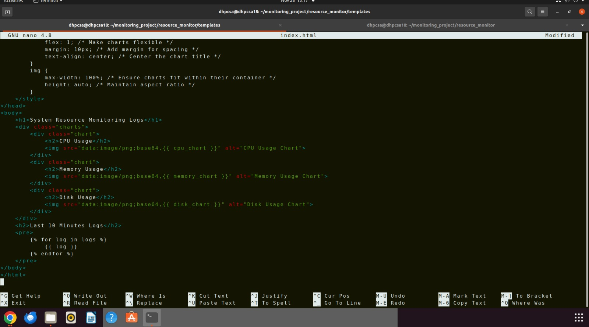

# System Resource Monitoring Project

A System Resource Monitoring Application that logs and visualizes system resource usage (CPU, memory, and disk) and displays real-time pie charts through a web interface built with Flask. The project includes simulation tools to stress-test the system and monitor its response.

<br>

## Features

### Resource Monitoring
- Logs CPU, memory, and disk usage in real time with customizable thresholds.

### Simulation of System Load
- Stress-test the system using the provided `simulate_load.sh` script.

### Visualization
- Displays resource usage in real-time pie charts using a Flask web application.

### Log Management
- Retains only the last 24 hours of logs for efficient storage.

### User Interface
- A clean and simple web interface showing:
  - Real-time pie charts for CPU, memory, and disk usage.
  - Logs from the last 10 minutes for quick analysis.
 

<br>

<br>


## Prerequisites

Ensure your system meets the following requirements:
- **Operating System**: Linux-based (tested on Ubuntu)
- **Python**: Version 3.6 or later
- **Flask**: Python web framework
- **stress-ng**: For simulating CPU and memory load
- **Permissions**: Write access to `/var/log/monitoring_project/`

## Installation

1. Clone the repository:
    ```bash
    git clone https://github.com/your-username/system-resource-monitoring.git
    cd system-resource-monitoring
    ```

2. Install dependencies:
    ```bash
    sudo apt update
    sudo apt install python3 python3-pip stress-ng
    pip3 install flask pandas matplotlib
    ```

3. Set up the log directory and file:
    ```bash
    sudo mkdir -p /var/log/monitoring_project
    sudo touch /var/log/monitoring_project/resource_monitor.log
    sudo chmod 666 /var/log/monitoring_project/resource_monitor.log
    ```

<br>

<br>


## Usage

### 1. Monitor Resources
Run the `monitor.sh` script to log system resources:
```bash
bash monitor.sh
```

Check recent logs by displaying logs from the last 10 minutes:
```bash
bash monitor.sh display
```

### 2. Simulate System Load
Use the `simulate_load.sh` script to simulate CPU, memory, and disk stress:
```bash
bash simulate_load.sh
```
This will:
- Simulate high CPU usage using 8 cores for 60 seconds.
- Simulate high memory usage using up to 85% of memory.
- Generate dummy files to increase disk usage.

### 3. Visualize in Browser
Start the Flask web application:
```bash
python3 app.py
```
Open your browser and navigate to `http://localhost:3000` to view:
- Real-time pie charts for resource usage.
- Logs from the last 10 minutes.

<br>

<br>


## File Overview

1. **monitor.sh**:
   - Logs system resource usage and checks for threshold breaches.
   - Sends alerts for usage exceeding defined thresholds.

2. **simulate_load.sh**:
   - Simulates high system resource usage for testing the monitoring script.
   - Uses `stress-ng` for CPU and memory load.
   - Creates temporary files to simulate disk stress.

3. **app.py**:
   - Flask-based web application for visualizing resource usage.
   - Parses logs from `monitor.sh`.
   - Displays pie charts for CPU, memory, and disk usage.
   - Shows logs from the last 10 minutes.

4. **templates/index.html**:
   - HTML template for the web application interface.
   - Displays resource usage pie charts.
   - Lists logs dynamically fetched from the server.
  

<br>

<br>


## Workflow

### Monitor System Resources
The `monitor.sh` script runs at intervals (via cron job or manually), logs CPU, memory, and disk usage, and alerts if usage crosses thresholds.

### Simulate Load (Optional)
Use `simulate_load.sh` to stress-test your system. The script generates load, allowing you to monitor the system's behavior.

### Visualize Usage
Launch the Flask app to view resource usage in real time with graphical representation.

### Analyze Logs
Access detailed logs of resource usage and threshold breaches for debugging or optimization.


<br>

<br>


   

## Future Enhancements
- Add email alerts for threshold breaches.
- Enable dynamic thresholds through the web interface.
- Store logs in a database for improved querying and analysis.


<br>
<br>
<br>


##                                         Screenshots


## 1.  monitor.sh 

<br>
<br>


2.  monitor.sh 
<br>
<br>


3. simulate_load.sh
<br>
<br>


<br>
<br>


## 4.  app.py

<br>
<br>


## 5.   app.py

<br>
<br>


## 6.  app.py

<br>
<br>


<br>
<br>


## 7.  index.html 

<br>
<br>


## 8.  index.html
<br>
<br>





## 9. stressng_load.sh
<br>
<br>


<br>
<br>
<br>
<br>

# ---------------Final Output---------------

**Web Interface**
   - Real-time pie charts and logs.


## 10. Before demo load 
<br>
<br>


<br>
<br>

<br>
<br>


## 11. After demo load
<br>
<br>


<br>
<br>


##  **Log Example**
   ```
   Wed 27 Nov 2024 10:00:00 PM IST: CPU usage is at 75%, Memory usage is at 65%, Disk usage is at 80%
   Wed 27 Nov 2024 10:01:00 PM IST: CPU usage is at 82%, Memory usage is at 70%, Disk usage is at 90% (Alert triggered)
   ```


